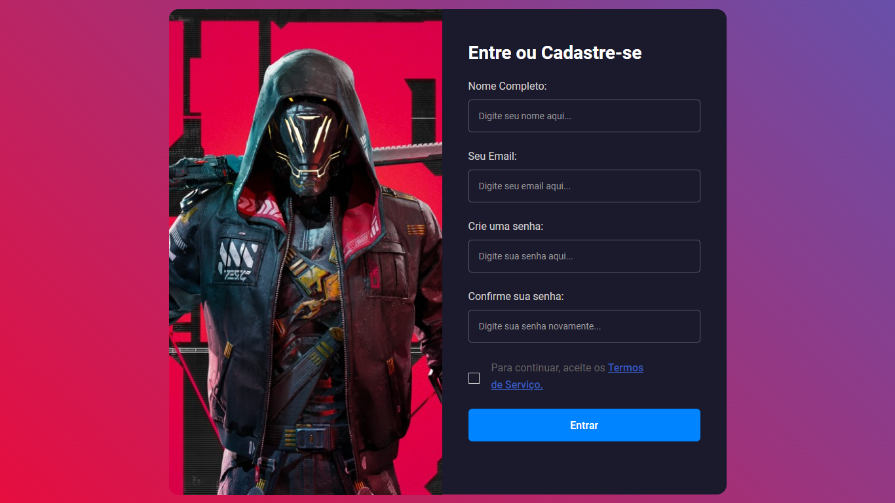

<h1 align="center">
  Login Screen  
</h1>

    Sample de uma tela de login responsiva com banckground animado. Exemplo simples e funcional para utilizar em qualquer website

    

<h2 align="center">O que é uma tela de login(login screen)?</h2>

    A tela de login permite que o usuário acesse a plataforma, inserindo o nome de usuário e senha adquiridos através de um cadastro feito pelo usuário ou um administrador. É possível também realizar login utilizando sua conta google, caso o administrador da instância tiver habilitado esta função.

Este projeto foi criado com o intuito de auxiliar e guiar desenvolvedores iniciantes no processo de criação desse tipo de conteúdo, trazendo um sample descomplicado e de fácil compreensão para proporcionar os mellhores resultados possíveis para todos aqueles que desejam se tornar bons devs. O projeto ainda está em fase de desenvolvimento. Atualizações futuras já são confirmadas.
  

